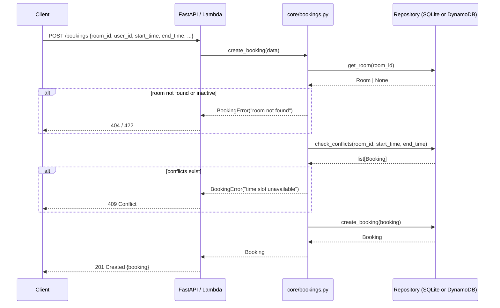
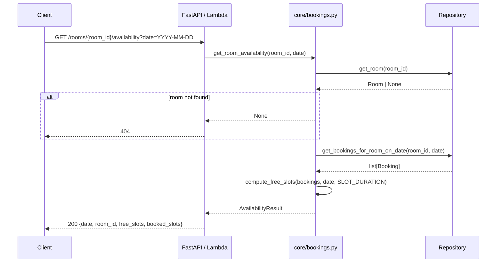

# Design Document: Room Booking API

## Overview

A backend API for managing room reservations in an office or facility setting. The system supports two deployment phases: Phase 1 runs locally using FastAPI + SQLite for development, and Phase 2 deploys to AWS using Lambda + API Gateway + DynamoDB for production. The storage layer is fully abstracted via a repository pattern so the same business logic runs in both phases — only the adapter changes.

The API manages three core domains: rooms (physical spaces with capacity and amenities), bookings (time-bounded reservations with conflict detection), and users (people who make reservations).

---

## Architecture

### High-Level System Architecture

```mermaid
graph TD
    subgraph Phase1["Phase 1 — Local Dev"]
        Client1[HTTP Client] --> FastAPI[FastAPI App\nfastapi_app/main.py]
        FastAPI --> Core[Business Logic\ncore/]
        Core --> SQLite[SQLite Adapter\ndb/sqlite_adapter.py]
        SQLite --> DB[(SQLite DB)]
    end

    subgraph Phase2["Phase 2 — AWS Production"]
        Client2[HTTP Client] --> APIGW[API Gateway]
        APIGW --> Lambda[lambda_handler.py]
        Lambda --> Core2[Business Logic\ncore/]
        Core2 --> Dynamo[DynamoDB Adapter\ndb/dynamo_adapter.py]
        Dynamo --> DDB[(DynamoDB Tables)]
        Lambda --> SSM[SSM Parameter Store\nconfig/table names]
    end

    subgraph Shared["Shared Layer"]
        Core --> BaseRepo[db/base.py\nAbstract Repository]
        Core2 --> BaseRepo
        SharedUtils[shared/utils.py\nresponse\\(\\), json_default\\(\\), parse_event\\(\\)]
        SharedConfig[shared/config.py\nenv / SSM config abstraction]
    end
```

### Project Structure

```
room-booking-api/
├── core/
│   ├── rooms.py            # room business logic
│   ├── bookings.py         # booking logic: conflict check, availability
│   └── users.py            # user business logic
├── db/
│   ├── base.py             # abstract repository interfaces
│   ├── sqlite_adapter.py   # Phase 1: SQLite implementation
│   └── dynamo_adapter.py   # Phase 2: DynamoDB implementation
├── fastapi_app/
│   └── main.py             # Phase 1: FastAPI routes + app factory
├── lambda_handler.py       # Phase 2: Lambda dispatcher (parse_event → route → response)
└── shared/
    ├── config.py           # env var / SSM Parameter Store abstraction
    └── utils.py            # response(), json_default(), parse_event(), normalize_path()
```

---

## Sequence Diagrams

### Create Booking Flow



### Check Room Availability Flow



---

## Data Models

### Room

```python
@dataclass
class Room:
    room_id: str          # UUID
    name: str             # e.g. "Boardroom A"
    floor: int
    capacity: int         # max occupants
    amenities: list[str]  # e.g. ["projector", "whiteboard", "video_conf"]
    status: str           # "active" | "inactive"
    created_at: str       # ISO 8601
    updated_at: str       # ISO 8601
```

Validation rules:
- `capacity` must be >= 1
- `status` must be one of `{"active", "inactive"}`
- `name` must be non-empty
- `amenities` is a list of strings (may be empty)

### Booking

```python
@dataclass
class Booking:
    booking_id: str       # UUID
    room_id: str          # FK → Room
    user_id: str          # FK → User
    title: str            # meeting title
    start_time: str       # ISO 8601 datetime
    end_time: str         # ISO 8601 datetime
    status: str           # "confirmed" | "cancelled"
    attendees: list[str]  # list of user_ids or email addresses
    notes: str            # optional free text
    created_at: str       # ISO 8601
    updated_at: str       # ISO 8601
```

Validation rules:
- `start_time` < `end_time`
- `end_time - start_time` >= 15 minutes
- `status` must be one of `{"confirmed", "cancelled"}`
- `room_id` and `user_id` must reference existing records

### User

```python
@dataclass
class User:
    user_id: str          # UUID
    name: str
    email: str            # unique
    department: str
    created_at: str       # ISO 8601
```

Validation rules:
- `email` must be a valid email format and unique
- `name` must be non-empty

---

## SQLite Schema (Phase 1)

```sql
CREATE TABLE rooms (
    room_id    TEXT PRIMARY KEY,
    name       TEXT NOT NULL,
    floor      INTEGER NOT NULL,
    capacity   INTEGER NOT NULL CHECK (capacity >= 1),
    amenities  TEXT NOT NULL DEFAULT '[]',  -- JSON array
    status     TEXT NOT NULL DEFAULT 'active' CHECK (status IN ('active','inactive')),
    created_at TEXT NOT NULL,
    updated_at TEXT NOT NULL
);

CREATE TABLE users (
    user_id    TEXT PRIMARY KEY,
    name       TEXT NOT NULL,
    email      TEXT NOT NULL UNIQUE,
    department TEXT NOT NULL DEFAULT '',
    created_at TEXT NOT NULL
);

CREATE TABLE bookings (
    booking_id TEXT PRIMARY KEY,
    room_id    TEXT NOT NULL REFERENCES rooms(room_id),
    user_id    TEXT NOT NULL REFERENCES users(user_id),
    title      TEXT NOT NULL,
    start_time TEXT NOT NULL,
    end_time   TEXT NOT NULL,
    status     TEXT NOT NULL DEFAULT 'confirmed' CHECK (status IN ('confirmed','cancelled')),
    attendees  TEXT NOT NULL DEFAULT '[]',  -- JSON array
    notes      TEXT NOT NULL DEFAULT '',
    created_at TEXT NOT NULL,
    updated_at TEXT NOT NULL
);

CREATE INDEX idx_bookings_room_time ON bookings(room_id, start_time, end_time);
CREATE INDEX idx_bookings_user     ON bookings(user_id);
```

---

## Repository Interface (Adapter Pattern)

```python
# db/base.py
from abc import ABC, abstractmethod
from typing import Optional
from core.models import Room, Booking, User

class RoomRepository(ABC):
    @abstractmethod
    def get(self, room_id: str) -> Optional[Room]: ...
    @abstractmethod
    def list(self, capacity: int = None, amenities: list[str] = None, floor: int = None) -> list[Room]: ...
    @abstractmethod
    def create(self, room: Room) -> Room: ...
    @abstractmethod
    def update(self, room: Room) -> Room: ...
    @abstractmethod
    def delete(self, room_id: str) -> None: ...  # sets status = "inactive"

class BookingRepository(ABC):
    @abstractmethod
    def get(self, booking_id: str) -> Optional[Booking]: ...
    @abstractmethod
    def list(self, user_id: str = None, room_id: str = None,
             date: str = None, status: str = None) -> list[Booking]: ...
    @abstractmethod
    def create(self, booking: Booking) -> Booking: ...
    @abstractmethod
    def update(self, booking: Booking) -> Booking: ...
    @abstractmethod
    def cancel(self, booking_id: str) -> Booking: ...
    @abstractmethod
    def get_overlapping(self, room_id: str, start_time: str, end_time: str,
                        exclude_booking_id: str = None) -> list[Booking]: ...

class UserRepository(ABC):
    @abstractmethod
    def get(self, user_id: str) -> Optional[User]: ...
    @abstractmethod
    def get_by_email(self, email: str) -> Optional[User]: ...
    @abstractmethod
    def list(self) -> list[User]: ...
    @abstractmethod
    def create(self, user: User) -> User: ...
```

Swapping Phase 1 → Phase 2 means passing a `DynamoBookingRepository()` instead of `SQLiteBookingRepository()` to the core service constructors. No business logic changes.

---

## Key Functions with Formal Specifications

### `check_conflicts(room_id, start_time, end_time, exclude_booking_id=None)`

```python
def check_conflicts(
    room_id: str,
    start_time: datetime,
    end_time: datetime,
    exclude_booking_id: str | None = None
) -> list[Booking]:
```

**Preconditions:**
- `room_id` is a non-empty string referencing an existing room
- `start_time < end_time`
- `end_time - start_time >= timedelta(minutes=15)`

**Postconditions:**
- Returns all confirmed bookings B for `room_id` where `B.start_time < end_time AND B.end_time > start_time`
- If `exclude_booking_id` is provided, that booking is excluded from results (used during reschedule)
- Returns empty list if no conflicts exist
- Does not mutate any state

**Loop Invariant:** For each booking examined, all previously accepted bookings satisfy the overlap condition.

---

### `create_booking(data) -> Booking`

```python
def create_booking(data: CreateBookingRequest) -> Booking:
```

**Preconditions:**
- `data.room_id` references an active room (`status == "active"`)
- `data.user_id` references an existing user
- `data.start_time < data.end_time`
- `check_conflicts(data.room_id, data.start_time, data.end_time)` returns `[]`

**Postconditions:**
- A new `Booking` record exists in the repository with `status == "confirmed"`
- The returned booking has a newly generated UUID as `booking_id`
- `booking.created_at == booking.updated_at` (set at creation time)
- No other bookings for the same room overlap the new booking's time window

**Invariant:** The total set of confirmed bookings for any room contains no two bookings with overlapping time intervals.

---

### `get_room_availability(room_id, date) -> AvailabilityResult`

```python
def get_room_availability(room_id: str, date: date) -> AvailabilityResult:
```

**Preconditions:**
- `room_id` references an existing room
- `date` is a valid calendar date

**Postconditions:**
- Returns `AvailabilityResult` with `free_slots` and `booked_slots` covering the full business day
- `free_slots ∪ booked_slots` covers the entire business day window without gaps
- `free_slots ∩ booked_slots = ∅` (no slot appears in both lists)
- Each slot has `start_time`, `end_time`, and `duration_minutes`

---

## Algorithmic Pseudocode

### Conflict Check Algorithm

```pascal
ALGORITHM check_conflicts(room_id, start_time, end_time, exclude_id)
INPUT:  room_id: string, start_time: datetime, end_time: datetime,
        exclude_id: string | null
OUTPUT: conflicts: list of Booking

PRECONDITION: start_time < end_time

BEGIN
  candidates ← repo.get_overlapping(room_id, start_time, end_time)

  conflicts ← []
  FOR each booking IN candidates DO
    IF booking.status = "cancelled" THEN
      CONTINUE
    END IF
    IF exclude_id IS NOT NULL AND booking.booking_id = exclude_id THEN
      CONTINUE
    END IF
    -- Overlap condition: intervals [s1,e1) and [s2,e2) overlap iff s1 < e2 AND s2 < e1
    IF booking.start_time < end_time AND booking.end_time > start_time THEN
      conflicts.append(booking)
    END IF
  END FOR

  RETURN conflicts
END

POSTCONDITION: ∀ b ∈ conflicts: b.status = "confirmed" AND b.start_time < end_time AND b.end_time > start_time
```

### Availability Computation Algorithm

```pascal
ALGORITHM compute_free_slots(bookings, date, slot_minutes)
INPUT:  bookings: list of confirmed Booking for the date,
        date: calendar date,
        slot_minutes: integer (default 30)
OUTPUT: free_slots: list of TimeSlot

BEGIN
  day_start ← datetime(date, BUSINESS_HOURS_START)   -- e.g. 08:00
  day_end   ← datetime(date, BUSINESS_HOURS_END)     -- e.g. 20:00

  -- Build sorted list of occupied intervals
  occupied ← SORT bookings BY start_time ASC

  free_slots ← []
  cursor ← day_start

  FOR each booking IN occupied DO
    IF cursor < booking.start_time THEN
      -- Gap between cursor and next booking: slice into fixed slots
      slot_start ← cursor
      WHILE slot_start + slot_minutes ≤ booking.start_time DO
        free_slots.append(TimeSlot(slot_start, slot_start + slot_minutes))
        slot_start ← slot_start + slot_minutes
      END WHILE
    END IF
    -- Advance cursor past this booking
    cursor ← MAX(cursor, booking.end_time)
  END FOR

  -- Remaining time after last booking
  WHILE cursor + slot_minutes ≤ day_end DO
    free_slots.append(TimeSlot(cursor, cursor + slot_minutes))
    cursor ← cursor + slot_minutes
  END WHILE

  RETURN free_slots
END

LOOP INVARIANT: cursor = end of last processed booking (or day_start);
                all slots in free_slots are non-overlapping and within [day_start, day_end]
POSTCONDITION:  free_slots covers all unbooked time in [day_start, day_end] in slot_minutes increments
```

---

## REST API Endpoints

### Rooms

| Method | Path | Description |
|--------|------|-------------|
| GET | `/rooms` | List rooms. Query: `capacity`, `amenities`, `floor` |
| POST | `/rooms` | Create a room |
| GET | `/rooms/{room_id}` | Get room details |
| PUT | `/rooms/{room_id}` | Update room |
| DELETE | `/rooms/{room_id}` | Deactivate room (soft delete) |
| GET | `/rooms/{room_id}/availability` | Available slots. Query: `date` (YYYY-MM-DD) |

### Bookings

| Method | Path | Description |
|--------|------|-------------|
| GET | `/bookings` | List bookings. Query: `user_id`, `room_id`, `date`, `status` |
| POST | `/bookings` | Create booking |
| GET | `/bookings/{booking_id}` | Get booking details |
| PUT | `/bookings/{booking_id}` | Reschedule / update booking |
| DELETE | `/bookings/{booking_id}` | Cancel booking |

### Users

| Method | Path | Description |
|--------|------|-------------|
| GET | `/users` | List users |
| POST | `/users` | Register user |
| GET | `/users/{user_id}` | Get user profile |
| GET | `/users/{user_id}/bookings` | User's bookings |

### Health

| Method | Path | Description |
|--------|------|-------------|
| GET | `/health` | Health check |

---

## Request / Response Schemas

### POST /bookings — Request

```json
{
  "room_id": "uuid",
  "user_id": "uuid",
  "title": "Sprint Planning",
  "start_time": "2025-09-01T09:00:00",
  "end_time": "2025-09-01T10:00:00",
  "attendees": ["uuid1", "uuid2"],
  "notes": "Bring laptops"
}
```

### POST /bookings — Response 201

```json
{
  "booking_id": "uuid",
  "room_id": "uuid",
  "user_id": "uuid",
  "title": "Sprint Planning",
  "start_time": "2025-09-01T09:00:00",
  "end_time": "2025-09-01T10:00:00",
  "status": "confirmed",
  "attendees": ["uuid1", "uuid2"],
  "notes": "Bring laptops",
  "created_at": "2025-08-20T14:32:00",
  "updated_at": "2025-08-20T14:32:00"
}
```

### GET /rooms/{room_id}/availability — Response 200

```json
{
  "room_id": "uuid",
  "date": "2025-09-01",
  "free_slots": [
    {"start_time": "2025-09-01T08:00:00", "end_time": "2025-09-01T08:30:00", "duration_minutes": 30},
    {"start_time": "2025-09-01T08:30:00", "end_time": "2025-09-01T09:00:00", "duration_minutes": 30}
  ],
  "booked_slots": [
    {"start_time": "2025-09-01T09:00:00", "end_time": "2025-09-01T10:00:00", "booking_id": "uuid", "title": "Sprint Planning"}
  ]
}
```

### Error Response (all errors)

```json
{
  "error": "time slot unavailable",
  "detail": "Room is already booked from 09:00 to 10:00"
}
```

---

## Error Handling

| Scenario | HTTP Status | Error Message |
|----------|-------------|---------------|
| Room not found | 404 | `"room not found"` |
| User not found | 404 | `"user not found"` |
| Booking not found | 404 | `"booking not found"` |
| Time slot conflict | 409 | `"time slot unavailable"` |
| Invalid time range (end ≤ start) | 422 | `"end_time must be after start_time"` |
| Booking duration < 15 min | 422 | `"minimum booking duration is 15 minutes"` |
| Room inactive | 422 | `"room is not available for booking"` |
| Duplicate email on user create | 409 | `"email already registered"` |
| Missing required field | 422 | `"field '{name}' is required"` |
| Cancel already-cancelled booking | 409 | `"booking is already cancelled"` |
| Internal error | 500 | `"internal server error"` |

---

## Phase 1 → Phase 2 Migration Path

The adapter pattern makes migration mechanical:

```python
# Phase 1 (local dev) — wire SQLite adapters
from db.sqlite_adapter import SQLiteRoomRepo, SQLiteBookingRepo, SQLiteUserRepo
room_repo    = SQLiteRoomRepo(db_path="bookings.db")
booking_repo = SQLiteBookingRepo(db_path="bookings.db")
user_repo    = SQLiteUserRepo(db_path="bookings.db")

# Phase 2 (AWS) — swap to DynamoDB adapters, zero business logic changes
from db.dynamo_adapter import DynamoRoomRepo, DynamoBookingRepo, DynamoUserRepo
room_repo    = DynamoRoomRepo(table_name=config.get("ROOMS_TABLE"))
booking_repo = DynamoBookingRepo(table_name=config.get("BOOKINGS_TABLE"))
user_repo    = DynamoUserRepo(table_name=config.get("USERS_TABLE"))
```

`shared/config.py` abstracts the source: in Phase 1 it reads environment variables; in Phase 2 it reads from SSM Parameter Store (following the `get_parameter_value()` pattern in `sample_lambda_as_api.py`).

The `lambda_handler.py` mirrors the routing pattern from `sample_lambda_as_api.py`:
- `parse_event()` normalizes API Gateway v1/v2 events
- `normalize_path()` strips stage prefixes
- `response()` returns the standard `{statusCode, headers, body}` shape
- Pure Python `if/elif` routing dispatches to the same core functions used by FastAPI

---

## Testing Strategy

### Unit Testing

Test each core function in isolation with mocked repositories:
- `check_conflicts`: verify overlap detection for adjacent, overlapping, and contained intervals
- `create_booking`: verify conflict guard, room active check, UUID generation
- `get_room_availability`: verify slot generation, boundary conditions, fully-booked day

### Property-Based Testing (Hypothesis)

```python
from hypothesis import given, strategies as st
from hypothesis.strategies import builds, datetimes

@given(
    start=datetimes(min_value=datetime(2025,1,1), max_value=datetime(2026,1,1)),
    duration=st.integers(min_value=15, max_value=480)
)
def test_no_double_booking(start, duration):
    """After a booking is created, check_conflicts always returns non-empty for the same slot."""
    end = start + timedelta(minutes=duration)
    repo = InMemoryBookingRepo()
    booking = make_booking(start, end, repo)
    conflicts = check_conflicts("room-1", start, end, repo=repo)
    assert len(conflicts) >= 1

@given(st.lists(booking_strategy(), min_size=0, max_size=20))
def test_availability_slots_no_overlap(bookings):
    """Free slots returned by get_room_availability never overlap each other."""
    slots = compute_free_slots(bookings, date.today(), slot_minutes=30)
    for i in range(len(slots) - 1):
        assert slots[i].end_time <= slots[i+1].start_time

@given(st.lists(booking_strategy(), min_size=0, max_size=20))
def test_availability_covers_business_day(bookings):
    """Union of free_slots and booked_slots covers the full business day."""
    free = compute_free_slots(bookings, date.today(), slot_minutes=30)
    booked = [TimeSlot(b.start_time, b.end_time) for b in bookings]
    all_slots = sorted(free + booked, key=lambda s: s.start_time)
    # No gaps larger than slot_minutes within business hours
    for i in range(len(all_slots) - 1):
        assert all_slots[i+1].start_time <= all_slots[i].end_time + timedelta(minutes=30)
```

**Property-Based Test Library**: `hypothesis`

### Integration Testing

- Spin up the FastAPI app with a real SQLite in-memory database
- Run the full HTTP request cycle for each endpoint
- Test the conflict detection end-to-end: create two overlapping bookings, assert second returns 409
- Test availability endpoint before and after creating bookings

---

## Dependencies

| Package | Phase | Purpose |
|---------|-------|---------|
| `fastapi` | Phase 1 | HTTP framework |
| `uvicorn` | Phase 1 | ASGI server |
| `pydantic` | Phase 1 | Request/response validation |
| `boto3` | Phase 2 | DynamoDB + SSM access |
| `hypothesis` | Both | Property-based testing |
| `pytest` | Both | Test runner |
| `python-dateutil` | Both | Datetime parsing |

---

## Correctness Properties

*A property is a characteristic or behavior that should hold true across all valid executions of a system — essentially, a formal statement about what the system should do. Properties serve as the bridge between human-readable specifications and machine-verifiable correctness guarantees.*

### Property 1: No Double Booking

*For any* room and any confirmed booking in that room, calling `check_conflicts` with the same room_id, start_time, and end_time must return a non-empty list (i.e., the existing booking is detected as a conflict).

**Validates: Requirements 5.1, 5.2**

---

### Property 2: Conflict Symmetry

*For any* two time intervals A and B, if `check_conflicts` reports that A conflicts with B, then `check_conflicts` must also report that B conflicts with A (the overlap predicate `start_A < end_B AND start_B < end_A` is symmetric).

**Validates: Requirements 5.3**

---

### Property 3: Cancelled Bookings Are Invisible to Conflict Check

*For any* room and any booking for that room that has been cancelled, calling `check_conflicts` with the same time interval must not include the cancelled booking in its results, and a new booking for that slot must be accepted.

**Validates: Requirements 5.5, 2.6**

---

### Property 4: Reschedule Excludes Self from Conflict Check

*For any* confirmed booking, rescheduling it to its own existing time slot (no actual change) must succeed — the Conflict_Checker must exclude the booking being rescheduled from its own conflict check.

**Validates: Requirements 5.4**

---

### Property 5: Free Slots Never Overlap Each Other

*For any* list of confirmed bookings for a room on a date, the `free_slots` returned by `compute_free_slots` must be pairwise non-overlapping (for all consecutive slots i and i+1: `slots[i].end_time <= slots[i+1].start_time`).

**Validates: Requirements 4.3, 4.6**

---

### Property 6: Free and Booked Slots Cover the Full Business Day

*For any* list of confirmed bookings for a room on a date, the union of `free_slots` and `booked_slots` must cover the entire Business_Day from BUSINESS_HOURS_START to BUSINESS_HOURS_END without gaps larger than the slot duration.

**Validates: Requirements 4.5**

---

### Property 7: Booked Slots Contain Only Confirmed Bookings

*For any* set of bookings with mixed statuses (confirmed and cancelled), the `booked_slots` in the availability response must contain only intervals corresponding to confirmed bookings; cancelled bookings must not appear.

**Validates: Requirements 4.4, 5.5**

---

### Property 8: Booking Duration Validation

*For any* booking request where `end_time - start_time` is less than 15 minutes, or where `end_time <= start_time`, the Validator must reject the request with HTTP 422.

**Validates: Requirements 6.1, 6.2**

---

### Property 9: Invalid Room Capacity Rejected

*For any* room creation or update request where `capacity` is less than 1, the Validator must reject the request with HTTP 422.

**Validates: Requirements 1.7**

---

### Property 10: List Filters Return Only Matching Records

*For any* collection of rooms or bookings in the repository, querying with a filter parameter (e.g., `capacity`, `floor`, `amenities`, `user_id`, `room_id`, `status`) must return only records that satisfy the filter predicate — no non-matching records may appear in the result.

**Validates: Requirements 1.2, 2.2**

---

### Property 11: Create-Then-Retrieve Round Trip

*For any* valid room, booking, or user that is successfully created via POST, retrieving it by its returned ID via GET must return a record with identical field values.

**Validates: Requirements 1.3, 2.3, 3.3**

---

### Property 12: Error Responses Always Contain Required Fields

*For any* request that causes an error response (4xx or 5xx), the response body must be valid JSON containing both an `"error"` field and a `"detail"` field.

**Validates: Requirements 8.1**

---

### Property 13: Soft Delete Sets Status to Inactive

*For any* room that is successfully deleted via DELETE /rooms/{room_id}, a subsequent GET /rooms/{room_id} must return the room with `status = "inactive"` rather than a 404.

**Validates: Requirements 1.6**

---

### Property 14: Duplicate Email Rejected

*For any* two user registration requests that use the same email address, the second request must be rejected with HTTP 409 regardless of the other field values.

**Validates: Requirements 3.8**
