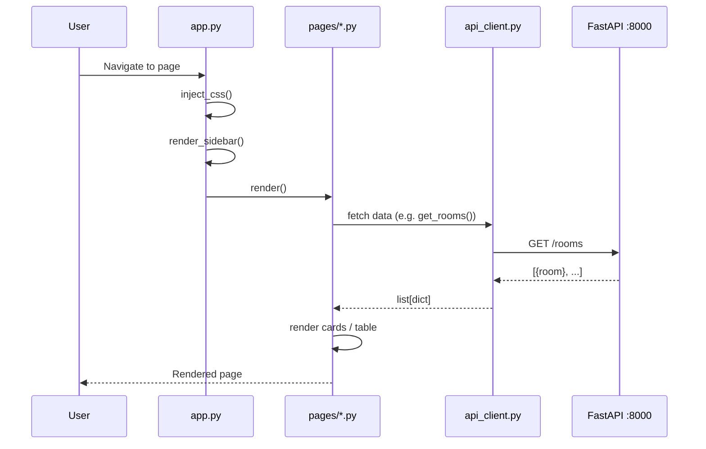
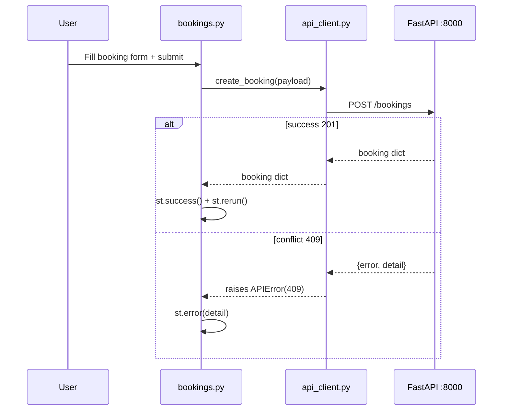
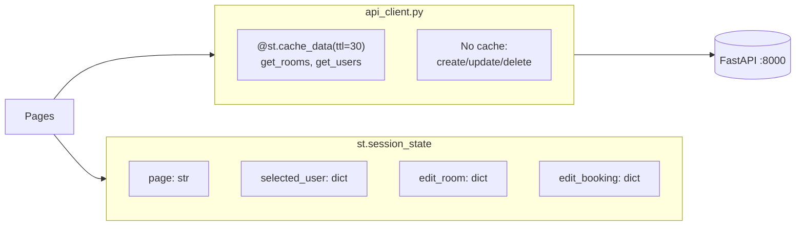

# Design Document: Room Booking UI

## Overview

A Streamlit-based frontend for the Room Booking System that communicates with the existing FastAPI backend at `http://localhost:8000`. The UI provides four main pages — Dashboard, Rooms, Bookings, and Users — with a consistent dark theme, smooth CSS transitions, and a minimalist card-based layout. All state is server-side (the API); Streamlit session state is used only for navigation and ephemeral form data.

The app is structured as a standalone `streamlit_app/` directory alongside `room-booking-api/`, with a thin HTTP client layer, reusable UI components, and a centralized theme/CSS injection system.

---

## Architecture

```mermaid
graph TD
    subgraph Browser["Browser"]
        UI[Streamlit UI]
    end

    subgraph StreamlitApp["streamlit_app/"]
        App[app.py\nEntry point + sidebar nav]
        Client[api_client.py\nHTTP client — requests]
        Theme[theme.py\nCSS constants + inject_css]

        subgraph Pages["pages/"]
            Dashboard[dashboard.py]
            Rooms[rooms.py]
            Bookings[bookings.py]
            Users[users.py]
        end

        subgraph Components["components/"]
            Cards[cards.py\nstat_card, room_card, booking_card]
            Forms[forms.py\nroom_form, booking_form, user_form]
        end
    end

    subgraph API["FastAPI Backend :8000"]
        Health[GET /health]
        RoomsAPI[/rooms + /rooms/{id}/availability]
        BookingsAPI[/bookings]
        UsersAPI[/users]
    end

    UI --> App
    App --> Pages
    Pages --> Components
    Pages --> Client
    Components --> Theme
    App --> Theme
    Client --> API
```

### Project Structure

```
streamlit_app/
├── app.py                  # entry point, sidebar nav, page routing
├── api_client.py           # thin HTTP wrapper for all API calls
├── theme.py                # CSS constants and inject_css()
├── pages/
│   ├── dashboard.py        # overview stats + quick actions
│   ├── rooms.py            # room list, filters, create/edit, availability
│   ├── bookings.py         # booking list, filters, create, cancel/reschedule
│   └── users.py            # user list, register, view bookings
└── components/
    ├── cards.py            # stat_card(), room_card(), booking_card(), user_card()
    └── forms.py            # room_form(), booking_form(), user_form()
```

---

## Sequence Diagrams

### Page Load Flow



### Create Booking Flow



---

## Color Theme & Design Tokens

```python
# theme.py — design tokens
COLORS = {
    "bg_primary":    "#0f1117",   # Streamlit default dark background
    "bg_surface":    "#1e2130",   # card / panel surface
    "bg_surface2":   "#262b3d",   # elevated surface (hover, modal)
    "accent":        "#6366f1",   # indigo-500 — primary accent
    "accent_hover":  "#4f46e5",   # indigo-600 — hover state
    "accent_muted":  "#312e81",   # indigo-900 — subtle accent bg
    "text_primary":  "#f1f5f9",   # slate-100
    "text_secondary":"#94a3b8",   # slate-400
    "success":       "#22c55e",   # green-500
    "warning":       "#f59e0b",   # amber-500
    "danger":        "#ef4444",   # red-500
    "border":        "#2d3348",   # subtle border
}

TYPOGRAPHY = {
    "font_family": "'Inter', 'Segoe UI', sans-serif",
    "size_xs":  "0.75rem",
    "size_sm":  "0.875rem",
    "size_base":"1rem",
    "size_lg":  "1.125rem",
    "size_xl":  "1.25rem",
    "size_2xl": "1.5rem",
    "size_3xl": "1.875rem",
}

SPACING = {
    "xs": "0.25rem",
    "sm": "0.5rem",
    "md": "1rem",
    "lg": "1.5rem",
    "xl": "2rem",
}

RADIUS = "0.75rem"
TRANSITION = "all 0.2s ease"
SHADOW = "0 4px 24px rgba(0,0,0,0.4)"
```

---

## CSS Snippet — Cards, Animations, Transitions

```css
/* Injected via st.markdown(<style>...</style>, unsafe_allow_html=True) */

/* ── Card base ── */
.rb-card {
    background: #1e2130;
    border: 1px solid #2d3348;
    border-radius: 0.75rem;
    padding: 1.25rem 1.5rem;
    transition: all 0.2s ease;
    box-shadow: 0 4px 24px rgba(0,0,0,0.4);
}
.rb-card:hover {
    background: #262b3d;
    border-color: #6366f1;
    transform: translateY(-2px);
    box-shadow: 0 8px 32px rgba(99,102,241,0.2);
}

/* ── Stat card ── */
.rb-stat-card {
    display: flex;
    flex-direction: column;
    gap: 0.5rem;
}
.rb-stat-value {
    font-size: 2rem;
    font-weight: 700;
    color: #6366f1;
    line-height: 1;
}
.rb-stat-label {
    font-size: 0.875rem;
    color: #94a3b8;
    text-transform: uppercase;
    letter-spacing: 0.05em;
}

/* ── Status badges ── */
.rb-badge {
    display: inline-block;
    padding: 0.2rem 0.6rem;
    border-radius: 9999px;
    font-size: 0.75rem;
    font-weight: 600;
    text-transform: uppercase;
    letter-spacing: 0.04em;
}
.rb-badge-confirmed  { background: rgba(34,197,94,0.15);  color: #22c55e; }
.rb-badge-cancelled  { background: rgba(239,68,68,0.15);  color: #ef4444; }
.rb-badge-active     { background: rgba(99,102,241,0.15); color: #6366f1; }
.rb-badge-inactive   { background: rgba(148,163,184,0.15);color: #94a3b8; }

/* ── Sidebar nav item ── */
.rb-nav-item {
    display: flex;
    align-items: center;
    gap: 0.75rem;
    padding: 0.6rem 1rem;
    border-radius: 0.5rem;
    cursor: pointer;
    transition: all 0.15s ease;
    color: #94a3b8;
    font-size: 0.9rem;
}
.rb-nav-item:hover, .rb-nav-item.active {
    background: rgba(99,102,241,0.15);
    color: #6366f1;
}

/* ── Availability calendar slot ── */
.rb-slot-free {
    background: rgba(34,197,94,0.12);
    border: 1px solid rgba(34,197,94,0.3);
    border-radius: 0.375rem;
    padding: 0.25rem 0.5rem;
    font-size: 0.75rem;
    color: #22c55e;
    transition: background 0.15s ease;
}
.rb-slot-booked {
    background: rgba(239,68,68,0.12);
    border: 1px solid rgba(239,68,68,0.3);
    border-radius: 0.375rem;
    padding: 0.25rem 0.5rem;
    font-size: 0.75rem;
    color: #ef4444;
}

/* ── Loading shimmer ── */
@keyframes shimmer {
    0%   { background-position: -200% 0; }
    100% { background-position:  200% 0; }
}
.rb-skeleton {
    background: linear-gradient(90deg, #1e2130 25%, #262b3d 50%, #1e2130 75%);
    background-size: 200% 100%;
    animation: shimmer 1.4s infinite;
    border-radius: 0.5rem;
    height: 1rem;
}

/* ── Page fade-in ── */
@keyframes fadeIn {
    from { opacity: 0; transform: translateY(8px); }
    to   { opacity: 1; transform: translateY(0); }
}
.rb-page {
    animation: fadeIn 0.3s ease forwards;
}

/* ── Streamlit overrides ── */
[data-testid="stSidebar"] { background: #1e2130 !important; }
[data-testid="stSidebar"] hr { border-color: #2d3348; }
.stButton > button {
    background: #6366f1;
    color: #fff;
    border: none;
    border-radius: 0.5rem;
    transition: background 0.15s ease, transform 0.1s ease;
}
.stButton > button:hover {
    background: #4f46e5;
    transform: translateY(-1px);
}
```

---

## Components and Interfaces

### `theme.py`

```python
def inject_css() -> None:
    """Inject all custom CSS into the Streamlit page via st.markdown."""

def badge_html(label: str, variant: str) -> str:
    """
    Return HTML string for a status badge.
    variant: 'confirmed' | 'cancelled' | 'active' | 'inactive'
    """

def card_html(content: str, extra_class: str = "") -> str:
    """Wrap content HTML in a .rb-card div."""
```

### `api_client.py`

```python
BASE_URL = "http://localhost:8000"

class APIError(Exception):
    def __init__(self, status_code: int, message: str, detail: str = ""): ...

# ── Health ──
def health_check() -> dict:
    """GET /health → {"status": "ok"}"""

# ── Rooms ──
def get_rooms(capacity: int = None, floor: int = None, amenities: list[str] = None) -> list[dict]:
    """GET /rooms with optional query filters"""

def get_room(room_id: str) -> dict:
    """GET /rooms/{room_id}"""

def create_room(payload: dict) -> dict:
    """POST /rooms"""

def update_room(room_id: str, payload: dict) -> dict:
    """PUT /rooms/{room_id}"""

def deactivate_room(room_id: str) -> None:
    """DELETE /rooms/{room_id}"""

def get_room_availability(room_id: str, date: str) -> dict:
    """GET /rooms/{room_id}/availability?date=YYYY-MM-DD"""

# ── Bookings ──
def get_bookings(user_id: str = None, room_id: str = None,
                 date: str = None, status: str = None) -> list[dict]:
    """GET /bookings with optional filters"""

def get_booking(booking_id: str) -> dict:
    """GET /bookings/{booking_id}"""

def create_booking(payload: dict) -> dict:
    """POST /bookings"""

def update_booking(booking_id: str, payload: dict) -> dict:
    """PUT /bookings/{booking_id}"""

def cancel_booking(booking_id: str) -> dict:
    """DELETE /bookings/{booking_id}"""

# ── Users ──
def get_users() -> list[dict]:
    """GET /users"""

def get_user(user_id: str) -> dict:
    """GET /users/{user_id}"""

def create_user(payload: dict) -> dict:
    """POST /users"""

def get_user_bookings(user_id: str) -> list[dict]:
    """GET /users/{user_id}/bookings"""
```

### `components/cards.py`

```python
def stat_card(label: str, value: int | str, icon: str, color: str = COLORS["accent"]) -> None:
    """Render a KPI stat card with icon, large value, and label."""

def room_card(room: dict, on_edit: callable = None, on_deactivate: callable = None) -> None:
    """
    Render a room card showing: name, floor, capacity, amenities badges, status badge.
    Optionally renders Edit / Deactivate action buttons.
    """

def booking_card(booking: dict, room_name: str = "", user_name: str = "",
                 on_cancel: callable = None, on_reschedule: callable = None) -> None:
    """
    Render a booking card showing: title, room, user, time range, status badge.
    Optionally renders Cancel / Reschedule action buttons.
    """

def user_card(user: dict, booking_count: int = 0, on_view: callable = None) -> None:
    """Render a user card showing: name, email, department, booking count."""

def availability_grid(availability: dict) -> None:
    """
    Render a time-slot grid for a room's availability.
    Free slots shown in green, booked slots in red with booking title.
    """
```

### `components/forms.py`

```python
def room_form(existing: dict = None) -> dict | None:
    """
    Render create/edit room form.
    Fields: name (text), floor (number), capacity (number), amenities (multiselect), status (select).
    Returns submitted payload dict or None if not submitted.
    existing: pre-populate fields for edit mode.
    """

def booking_form(rooms: list[dict], users: list[dict], existing: dict = None) -> dict | None:
    """
    Render create/reschedule booking form.
    Fields: room (select), user (select), title (text), date (date_input),
            start_time (time_input), end_time (time_input), attendees (multiselect), notes (text_area).
    Returns submitted payload dict or None if not submitted.
    """

def user_form(existing: dict = None) -> dict | None:
    """
    Render register/edit user form.
    Fields: name (text), email (text), department (text).
    Returns submitted payload dict or None if not submitted.
    """

def confirm_dialog(message: str, key: str) -> bool:
    """
    Render an inline confirmation prompt (Yes / Cancel buttons).
    Returns True when user clicks Yes.
    """
```

---

## Page Layout Pseudocode

### `app.py` — Entry Point

```pascal
PROCEDURE main()
BEGIN
  st.set_page_config(title="Room Booking", layout="wide", initial_sidebar_state="expanded")
  inject_css()

  IF "page" NOT IN st.session_state THEN
    st.session_state.page ← "dashboard"
  END IF

  -- Sidebar navigation
  WITH st.sidebar DO
    st.image(logo, width=40)
    st.title("Room Booking")
    st.divider()

    FOR each (icon, label, key) IN NAV_ITEMS DO
      IF st.button(icon + " " + label, key=key, use_container_width=True) THEN
        st.session_state.page ← key
        st.rerun()
      END IF
    END FOR

    st.divider()
    -- API health indicator
    status ← health_check()
    IF status.ok THEN
      st.success("API connected")
    ELSE
      st.error("API unreachable")
    END IF
  END WITH

  -- Route to page
  MATCH st.session_state.page WITH
    "dashboard" → render_dashboard()
    "rooms"     → render_rooms()
    "bookings"  → render_bookings()
    "users"     → render_users()
  END MATCH
END
```

### `pages/dashboard.py`

```pascal
PROCEDURE render_dashboard()
BEGIN
  st.markdown('<div class="rb-page">', unsafe_allow_html=True)
  st.title("Dashboard")

  -- Fetch data concurrently (sequential in Streamlit)
  WITH st.spinner("Loading stats...") DO
    rooms    ← get_rooms()
    bookings ← get_bookings()
    users    ← get_users()
  END WITH

  -- KPI row
  active_rooms    ← COUNT rooms WHERE status = "active"
  total_bookings  ← COUNT bookings
  confirmed_today ← COUNT bookings WHERE date(start_time) = today AND status = "confirmed"
  total_users     ← COUNT users

  cols ← st.columns(4)
  cols[0]: stat_card("Active Rooms",    active_rooms,    "🏢")
  cols[1]: stat_card("Total Bookings",  total_bookings,  "📅")
  cols[2]: stat_card("Today's Meetings",confirmed_today, "✅", color=SUCCESS)
  cols[3]: stat_card("Registered Users",total_users,     "👥")

  st.divider()

  -- Two-column layout: recent bookings + room utilization
  left, right ← st.columns([2, 1])

  WITH left DO
    st.subheader("Recent Bookings")
    recent ← SORT bookings BY created_at DESC LIMIT 5
    FOR each booking IN recent DO
      booking_card(booking)
    END FOR
  END WITH

  WITH right DO
    st.subheader("Room Status")
    FOR each room IN rooms LIMIT 6 DO
      room_utilization_mini(room)
    END FOR
  END WITH

  st.markdown('</div>', unsafe_allow_html=True)
END
```

### `pages/rooms.py`

```pascal
PROCEDURE render_rooms()
BEGIN
  st.markdown('<div class="rb-page">', unsafe_allow_html=True)

  header_col, btn_col ← st.columns([3, 1])
  header_col: st.title("Rooms")
  btn_col: show_create ← st.button("+ New Room")

  IF show_create OR st.session_state.get("show_room_form") THEN
    WITH st.expander("Create Room", expanded=True) DO
      payload ← room_form()
      IF payload IS NOT NULL THEN
        WITH st.spinner("Creating...") DO
          TRY
            create_room(payload)
            st.success("Room created")
            st.rerun()
          CATCH APIError AS e
            st.error(e.detail)
          END TRY
        END WITH
      END IF
    END WITH
  END IF

  -- Filters
  WITH st.expander("Filters", expanded=False) DO
    f_col1, f_col2, f_col3 ← st.columns(3)
    min_capacity ← f_col1.number_input("Min Capacity", min=1)
    floor_filter ← f_col2.number_input("Floor", min=0)
    amenity_filter ← f_col3.multiselect("Amenities", AMENITY_OPTIONS)
  END WITH

  WITH st.spinner("Loading rooms...") DO
    rooms ← get_rooms(capacity=min_capacity, floor=floor_filter, amenities=amenity_filter)
  END WITH

  IF rooms IS EMPTY THEN
    st.info("No rooms found.")
    RETURN
  END IF

  -- Grid: 3 columns
  FOR i IN range(0, len(rooms), 3) DO
    cols ← st.columns(3)
    FOR j IN 0..2 DO
      IF i+j < len(rooms) THEN
        WITH cols[j] DO
          room_card(rooms[i+j],
            on_edit=lambda r: open_edit_modal(r),
            on_deactivate=lambda r: confirm_deactivate(r))
        END WITH
      END IF
    END FOR
  END FOR

  -- Availability viewer
  st.divider()
  st.subheader("Room Availability")
  sel_room ← st.selectbox("Select Room", [r["name"] for r in rooms])
  sel_date ← st.date_input("Date", value=today)
  IF sel_room AND sel_date THEN
    room_id ← rooms[sel_room]["room_id"]
    WITH st.spinner("Fetching availability...") DO
      avail ← get_room_availability(room_id, str(sel_date))
    END WITH
    availability_grid(avail)
  END IF

  st.markdown('</div>', unsafe_allow_html=True)
END
```

### `pages/bookings.py`

```pascal
PROCEDURE render_bookings()
BEGIN
  st.markdown('<div class="rb-page">', unsafe_allow_html=True)

  header_col, btn_col ← st.columns([3, 1])
  header_col: st.title("Bookings")
  btn_col: show_create ← st.button("+ New Booking")

  IF show_create THEN
    WITH st.expander("Create Booking", expanded=True) DO
      rooms ← get_rooms()
      users ← get_users()
      payload ← booking_form(rooms, users)
      IF payload IS NOT NULL THEN
        WITH st.spinner("Creating booking...") DO
          TRY
            create_booking(payload)
            st.success("Booking confirmed")
            st.rerun()
          CATCH APIError AS e
            st.error(e.detail)
          END TRY
        END WITH
      END IF
    END WITH
  END IF

  -- Filters
  WITH st.expander("Filters", expanded=True) DO
    fc1, fc2, fc3, fc4 ← st.columns(4)
    date_filter   ← fc1.date_input("Date")
    room_filter   ← fc2.selectbox("Room", ["All"] + room_names)
    user_filter   ← fc3.selectbox("User", ["All"] + user_names)
    status_filter ← fc4.selectbox("Status", ["All", "confirmed", "cancelled"])
  END WITH

  WITH st.spinner("Loading bookings...") DO
    bookings ← get_bookings(
      date=date_filter if date_filter else None,
      room_id=room_id_for(room_filter),
      user_id=user_id_for(user_filter),
      status=status_filter if status_filter != "All" else None
    )
  END WITH

  IF bookings IS EMPTY THEN
    st.info("No bookings found.")
    RETURN
  END IF

  FOR each booking IN bookings DO
    booking_card(booking,
      room_name=room_name_for(booking["room_id"]),
      user_name=user_name_for(booking["user_id"]),
      on_cancel=lambda b: handle_cancel(b),
      on_reschedule=lambda b: open_reschedule_form(b))
  END FOR

  st.markdown('</div>', unsafe_allow_html=True)
END

PROCEDURE handle_cancel(booking)
BEGIN
  IF confirm_dialog("Cancel this booking?", key=booking["booking_id"]) THEN
    WITH st.spinner("Cancelling...") DO
      TRY
        cancel_booking(booking["booking_id"])
        st.success("Booking cancelled")
        st.rerun()
      CATCH APIError AS e
        st.error(e.detail)
      END TRY
    END WITH
  END IF
END
```

### `pages/users.py`

```pascal
PROCEDURE render_users()
BEGIN
  st.markdown('<div class="rb-page">', unsafe_allow_html=True)

  header_col, btn_col ← st.columns([3, 1])
  header_col: st.title("Users")
  btn_col: show_create ← st.button("+ Register User")

  IF show_create THEN
    WITH st.expander("Register User", expanded=True) DO
      payload ← user_form()
      IF payload IS NOT NULL THEN
        WITH st.spinner("Registering...") DO
          TRY
            create_user(payload)
            st.success("User registered")
            st.rerun()
          CATCH APIError AS e
            st.error(e.detail)
          END TRY
        END WITH
      END IF
    END WITH
  END IF

  WITH st.spinner("Loading users...") DO
    users ← get_users()
  END WITH

  IF users IS EMPTY THEN
    st.info("No users registered.")
    RETURN
  END IF

  -- Grid: 3 columns
  FOR i IN range(0, len(users), 3) DO
    cols ← st.columns(3)
    FOR j IN 0..2 DO
      IF i+j < len(users) THEN
        WITH cols[j] DO
          user_card(users[i+j],
            on_view=lambda u: show_user_bookings(u))
        END WITH
      END IF
    END FOR
  END FOR

  -- User bookings drawer
  IF st.session_state.get("selected_user") THEN
    user ← st.session_state.selected_user
    st.divider()
    st.subheader(f"Bookings for {user['name']}")
    WITH st.spinner("Loading...") DO
      user_bookings ← get_user_bookings(user["user_id"])
    END WITH
    FOR each booking IN user_bookings DO
      booking_card(booking)
    END FOR
  END IF

  st.markdown('</div>', unsafe_allow_html=True)
END
```

---

## Data Flow



Key caching decisions:
- `get_rooms()` and `get_users()` use `@st.cache_data(ttl=30)` — these are read-heavy and change infrequently
- All write operations (create/update/delete) bypass cache and call `st.cache_data.clear()` after success
- `get_bookings()` is not cached — booking state changes frequently

---

## Error Handling

| Scenario | UI Response |
|----------|-------------|
| API unreachable | Sidebar shows red "API unreachable" badge; pages show `st.error("Cannot connect to API")` |
| 404 Not Found | `st.warning("Resource not found")` |
| 409 Conflict (booking) | `st.error("Time slot unavailable: <detail>")` inline in form |
| 422 Validation | `st.error("<field> <message>")` inline in form |
| 500 Server Error | `st.error("Server error — please try again")` |
| Network timeout | `st.error("Request timed out")` with retry button |

All API calls are wrapped in try/except catching `APIError` and `requests.exceptions.RequestException`.

---

## Testing Strategy

### Unit Testing

- `api_client.py`: mock `requests.get/post/put/delete` with `unittest.mock.patch`; verify correct URL construction, query params, payload serialization, and `APIError` raising on non-2xx responses
- `theme.py`: verify `badge_html()` returns correct CSS class for each variant
- `components/cards.py`: verify HTML output contains expected data fields

### Integration Testing

- Spin up the FastAPI app in a subprocess, run the Streamlit app in headless mode
- Use `streamlit.testing.v1.AppTest` to simulate user interactions and assert rendered output

### Property-Based Testing

- `api_client.py` URL construction: for any valid room_id string, `get_room(room_id)` constructs URL `BASE_URL + "/rooms/" + room_id`
- Filter combinations: for any subset of filter params, `get_rooms()` includes only non-None params in the query string

**Property-Based Test Library**: `hypothesis`

---

## Performance Considerations

- `@st.cache_data(ttl=30)` on `get_rooms()` and `get_users()` avoids redundant API calls during a session
- Availability grid renders at most 24 slots (30-min intervals over 12-hour business day) — no pagination needed
- Booking list uses `st.dataframe` for large result sets (>20 items) instead of individual cards
- All API calls have a 5-second timeout to prevent UI hangs

---

## Security Considerations

- No authentication in Phase 1 (matches API design); all users share the same session
- API base URL is configurable via `API_BASE_URL` environment variable (default `http://localhost:8000`)
- No secrets stored in the Streamlit app; all data lives in the API
- User input is passed directly to the API which performs all validation — no client-side validation bypass risk

---

## Dependencies

| Package | Purpose |
|---------|---------|
| `streamlit>=1.32` | UI framework |
| `requests` | HTTP client for API calls |
| `python-dateutil` | Date/time parsing and formatting |
| `hypothesis` | Property-based testing |
| `pytest` | Test runner |
